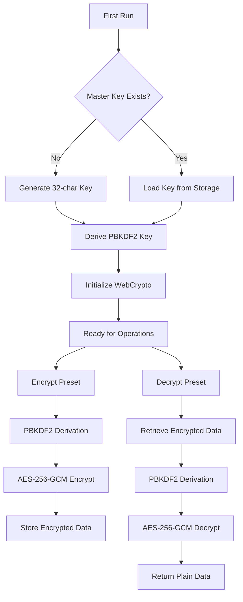
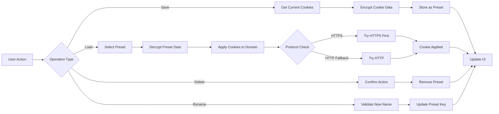
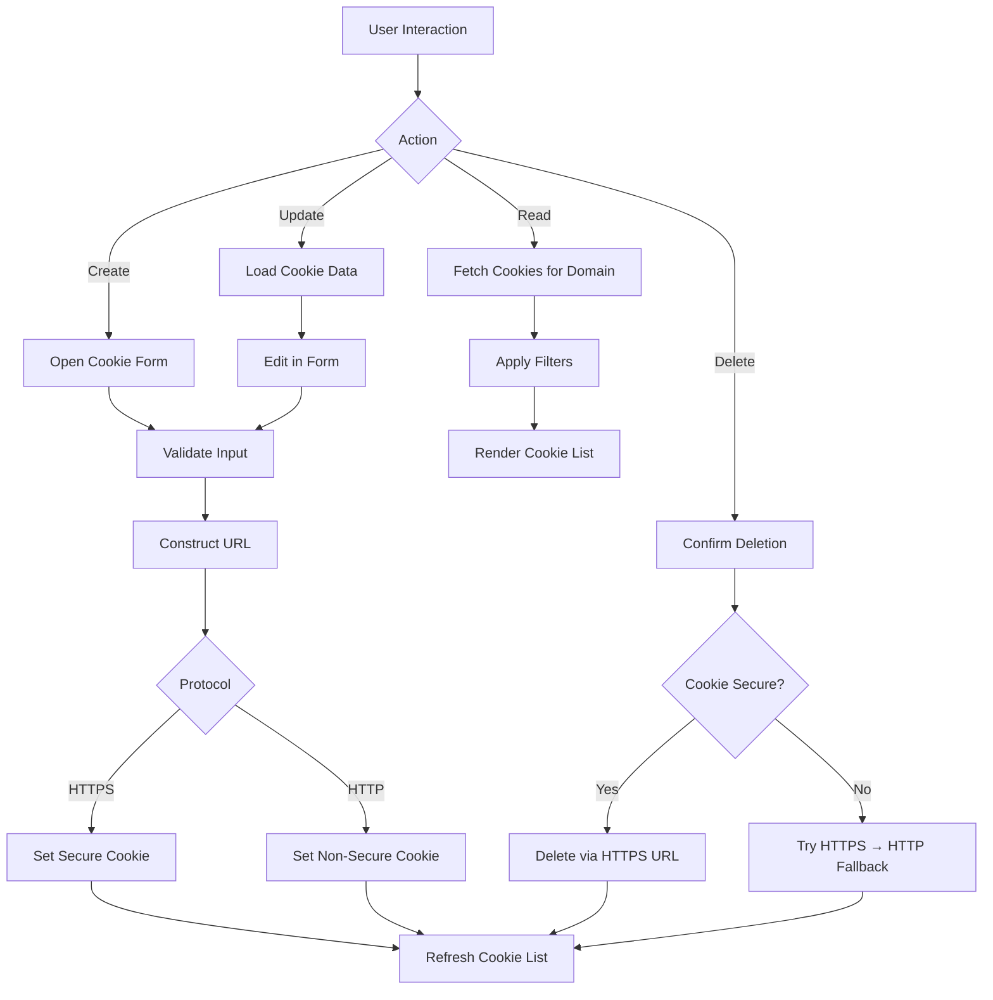
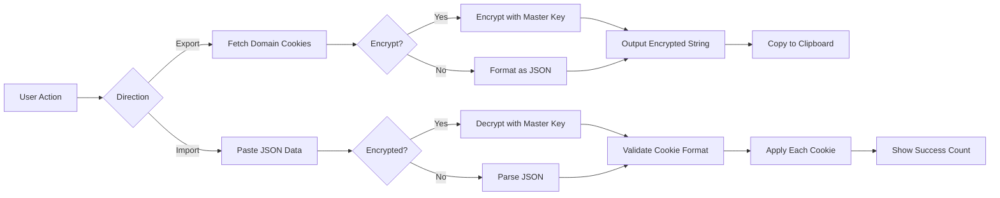

<div align="center">

# 🍪 Cooklix


**Minimalist Cookie Manager with AES-256-GCM Encryption**

A Chrome/Chromium extension for advanced cookie management with encryption, preset management, and seamless import/export.

[](https://chrome.google.com/webstore)
[](https://developer.chrome.com/docs/extensions/mv3/intro/)
[](LICENSE)

</div>

---

## ✨ Features

| Feature | Description |
|---------|-------------|
| 🔐 **AES-256-GCM Encryption** | Auto-generated master key, PBKDF2 derivation, secure local storage |
| 🔄 **Preset System** | Save/load cookie sets for quick account switching |
| 📦 **Import/Export** | JSON format with optional encryption |
| 🎨 **Dark Theme** | Clean, minimalistic interface optimized for productivity |
| ⚡ **Zero Dependencies** | Pure JavaScript, no external libraries |

---

## 🚀 Quick Start

### Installation
```bash
1. Navigate to chrome://extensions/
2. Enable "Developer mode" (top-right toggle)
3. Click "Load unpacked" → Select this directory
4. Done! Click the Cooklix icon to begin
```

### First Use
On first launch, Cooklix automatically:
- Generates a 32-character encryption key
- Initializes secure storage
- Displays welcome screen with feature overview

---

## 🏗️ Architecture

### Extension Structure
```
Cooklix/
├── manifest.json              # Manifest V3 configuration
├── background/
│   └── service-worker.js     # Cookie operations & encryption
├── popup/
│   ├── popup.html            # UI structure
│   └── popup.js              # Event handlers & state
├── lib/
│   └── crypto.js             # AES-256-GCM encryption
├── styles/
│   └── popup.css             # Dark theme styling
└── icons/                    # Extension icons (16/48/128)
```

---

## 📊 System Flowcharts

### Encryption System Architecture



### Cookie Preset Management Flow



### Cookie CRUD Operations



### Import/Export Process



---

## 🔒 Security Model

### Encryption Pipeline
1. **Key Generation**: Cryptographically secure 32-character key on first run
2. **Key Derivation**: PBKDF2 with 100,000 iterations
3. **Encryption**: AES-256-GCM with random IV per operation
4. **Storage**: Master key in Chrome's encrypted `storage.local`

### Race Condition Prevention
- **Operation Lock**: Global mutex prevents concurrent preset operations
- **Atomic Operations**: Each cookie operation completes before next begins
- **State Validation**: Checks operation lock before critical sections

### URL Protocol Handling
```javascript
// HTTPS-first approach with HTTP fallback
1. Attempt HTTPS URL construction
2. If fails AND cookie is non-secure → Retry with HTTP
3. Report detailed error on failure
```

---

## 🎯 Use Cases

| Scenario | Solution |
|----------|----------|
| **Multi-Account Management** | Save cookies for each account as presets, switch instantly |
| **Development Testing** | Export production cookies, import to local environment |
| **Session Backup** | Encrypt and export critical session cookies |
| **Cross-Browser Sync** | Export from one browser, import to another |

---

## 🛠️ Technical Stack

- **Platform**: Chrome Extension (Manifest V3)
- **Language**: Vanilla JavaScript (ES6+)
- **Crypto**: Web Crypto API (AES-256-GCM, PBKDF2)
- **Storage**: Chrome Storage API
- **UI**: Custom CSS (Dark Theme)

---

## 📝 Cookie Format

Cooklix supports standard Chrome cookie format:

```json
[
  {
    "domain": ".example.com",
    "expirationDate": 1234567890,
    "hostOnly": false,
    "httpOnly": false,
    "name": "session_id",
    "path": "/",
    "sameSite": "lax",
    "secure": true,
    "session": false,
    "value": "abc123xyz"
  }
]
```

---

## 🧪 Testing Checklist

- [ ] Load extension in `chrome://extensions/`
- [ ] Verify welcome screen on first run
- [ ] Test cookie CRUD operations
- [ ] Save preset with multiple cookies
- [ ] Load preset to different domain
- [ ] Export cookies (encrypted & plain)
- [ ] Import cookies from JSON
- [ ] Verify operation locking (rapid clicks)
- [ ] Test HTTPS/HTTP protocol fallback

---

## 🔄 Recent Updates

**2025-10-07** - Cooklix Rebrand & Enhancements
- ✅ Rebranded from "Cookie Manager Pro" to "Cooklix"
- ✅ Implemented minimalistic dark theme UI
- ✅ Fixed preset manager race conditions with operation locking
- ✅ Improved URL construction with HTTPS-first approach
- ✅ Enhanced error handling and user feedback
- ✅ Added comprehensive flowchart documentation

---

## 📄 License

MIT License - See [LICENSE](LICENSE) file for details

---

<div align="center">

**Built with ❤️ for Cookie Management**

[Report Bug](https://github.com/yourusername/cooklix/issues) · [Request Feature](https://github.com/yourusername/cooklix/issues)

</div>
